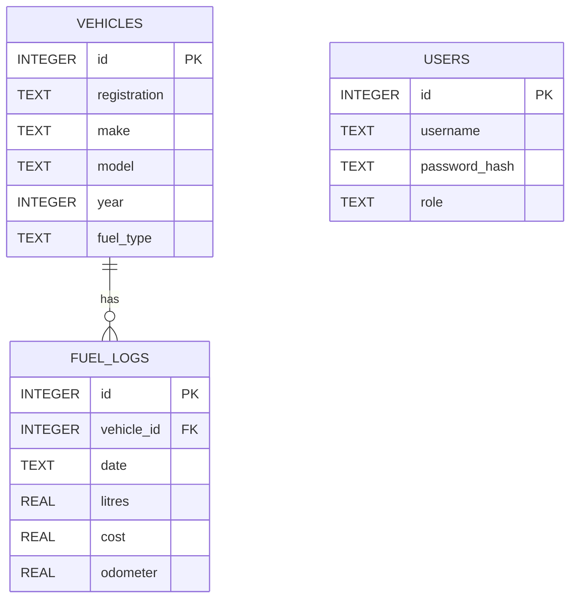

# Preliminary SQLite Database Design

This is an initial design to guide Sprint 1 implementation. It can be refined
when the team begins TDD and database integration.

## Proposed entities

### users
Stores authentication and role information.

### vehicles
Stores fleet vehicle details.

### fuel_logs
Stores individual fuel fill-ups associated with vehicles.

## Initial schema

```sql
PRAGMA foreign_keys = ON;

CREATE TABLE users (
    id INTEGER PRIMARY KEY AUTOINCREMENT,
    username TEXT NOT NULL UNIQUE,
    password_hash TEXT NOT NULL,
    role TEXT NOT NULL
);

CREATE TABLE vehicles (
    id INTEGER PRIMARY KEY AUTOINCREMENT,
    registration TEXT NOT NULL UNIQUE,
    make TEXT NOT NULL,
    model TEXT NOT NULL,
    year INTEGER,
    fuel_type TEXT
);

CREATE TABLE fuel_logs (
    id INTEGER PRIMARY KEY AUTOINCREMENT,
    vehicle_id INTEGER NOT NULL,
    date TEXT NOT NULL,
    litres REAL NOT NULL CHECK (litres > 0),
    cost REAL NOT NULL CHECK (cost >= 0),
    odometer REAL NOT NULL CHECK (odometer >= 0),
    FOREIGN KEY (vehicle_id) REFERENCES vehicles(id)
);
```

## Relationship



## Design notes

- Vehicle registration is unique so duplicate active records are avoided.
- Fuel logs use a foreign key so every fuel entry belongs to a vehicle.
- Positive-value checks provide a first database-level defence against invalid
  fuel data.
- Passwords should not be stored as plain text.
- Authentication design can be expanded later if drivers require individual
  accounts.
